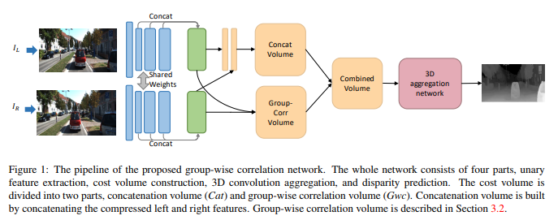
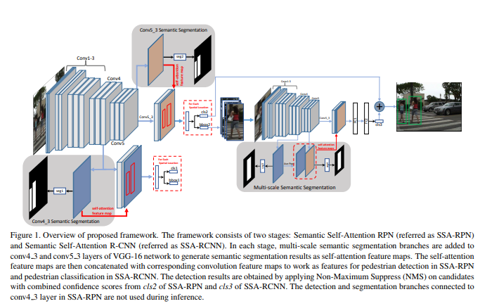
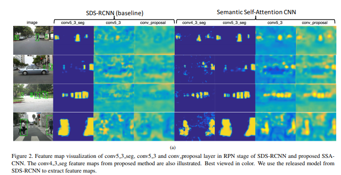

[Stereo R-CNN based 3D Object Detection for Autonomous Driving](https://arxiv.org/abs/1902.09738)，
3D目标检测  
讨论 issue：[issues/12](https://github.com/DeepTecher/AutonomousVehiclePaper/issues/12)  

作者：Peiliang Li,Xiaozhi Chen（陈晓智--DJI，MV3D的作者）,Shaojie Shen（港科大[Areial Robotics Group ](http://uav.ust.hk/)沈劭劼老师）

研究机构：香港科技大学、大疆

摘要 ： 我们通过充分利用立体图像中的稀疏，密集，语义和几何信息，提出了一种用于自动驾驶的三维物体检测方法。 我们的方法，
称为Stereo R-CNN，扩展了更快的R-CNN用于立体声输入，以同时检测和关联左右图像中的对象。 我们在立体声区域提议网络（RPN）之
后添加额外分支来预测稀疏关键点，视点和对象维度，这些关键点与2D左右框组合以计算粗略的3D对象边界框。 然后，我们通过使用左
右RoI的基于区域的光度对准来恢复精确的3D边界框。 我们的方法不需要深度输入和3D位置监控，但是，优于所有现有的完全监督的基于
图像的方法。 在具有挑战性的KITTI数据集上的实验表明，我们的方法在3D检测和3D定位任务上的性能优于最先进的基于立体的方法约30％AP。 
代码将公开发布。  
  

  

  

[Group-wise Correlation Stereo Network](https://arxiv.org/abs/1903.04025)，
立体匹配（KITTI Stereo Evaluation 2012 、KITTI Stereo Evaluation 2015）  
讨论 issue：[issues/18](https://github.com/DeepTecher/AutonomousVehiclePaper/issues/18)

作者：Xiaoyang Guo,Kai Yang,Wukui Yang,Xiaogang Wang,Hongsheng Li

团队：香港中文大学电子工程系、商汤科技

摘要： 立体匹配估计整流图像对之间的差异，这对深度感测、自动驾驶和其他相关任务非常重要。先前的工作建立了在所有视差水平上具
有交叉相关或串联左右特征的成本量，然后利用2D或3D卷积神经网络来回归视差图。在本文中，我们建议通过分组相关来构建成本量。左
边特征和右边特征沿着通道维度被分成组，并且在每个组之间计算相关图以获得多个匹配成本提议，然后将其打包到成本量中。分组相关
为测量特征相似性提供了有效的表示，并且不会丢失过多的信息，如完全相关。与以前的方法相比，它在减少参数时也能保持更好的性能。
在先前的工作中提出的3D堆叠沙漏网络被改进以提高性能并降低推理计算成本。实验结果表明，我们的方法在Scene Flow，KITTI 2012
和KITTI 2015数据集上优于以前的方法。此代码可通过[xy-guo/GwcNet](https://github.com/xy-guo/GwcNet)（代码待更新）获得。  

  

  

[Hierarchical Discrete Distribution Decomposition for Match Density Estimation](https://arxiv.org/abs/1812.06264),
立体匹配，(KITTI Stereo Evaluation 2012、KITTI Stereo Evaluation 2015)，  
讨论 issue：[issues/21](https://github.com/DeepTecher/AutonomousVehiclePaper/issues/21)    
研究结构：伯克利[DeepDrive](https://deepdrive.berkeley.edu/)  
作者：Zhichao Yin(个人[GitHub](https://github.com/yzcjtr) ,CVPR 2018 GeoNet),
Trevor Darrell,Fisher Yu

摘要：用于像素对应的现有深度学习方法输出运动场的点估计，但不表示完全匹配分布。匹配分布的显式表示对于许多应用是期望的，
因为它允许直接表示对应概率。使用深度网络估计全概率分布的主要困难是推断整个分布的高计算成本。在本文中，我们提出了分层离散
分布分解，称为HD3，以学习概率点和区域匹配。它不仅可以模拟匹配不确定性，还可以模拟区域传播。为了实现这一点，我们估计了不同
图像尺度下像素对应的层次分布，而没有多假设集合。尽管它很简单，但我们的方法可以在既定基准上实现光流和立体匹配的竞争结果，
而估计的不确定性是错误的良好指标。此外，即使区域在图像上变化，也可以将区域内的点匹配分布组合在一起以传播整个区域。

  

  

[Deep Rigid Instance Scene Flow ](http://people.csail.mit.edu/weichium/papers/cvpr19-drisf/paper.pdf)
（ :trophy: SOTA for Scene Flow Evaluation 2015），  
讨论 issue：

研究机构：Uber ATG部门、MIT、多伦多大学

作者：Wei-Chiu Ma（马惟九、MIT PhD、Uber ATG 多伦多、两篇CVPR 2019--另外一篇
`Convolutional Recurrent Network for Road Boundary Extraction`、[个人主页](http://people.csail.mit.edu/weichium/)） 、
Shenlong Wang 、Rui Hu、Yuwen Xiong、 Raquel Urtasun（Uber ATG Chief Scientist 、[个人主页](http://www.cs.toronto.edu/~urtasun/)）

摘要： 在本文中，我们解决了自动驾驶环境下的场景流量估计问题。 我们利用深度学习技术以及强大的先验，因为在我们的应用领域中，
场景的运动可以由机器人的运动和场景中的演员的3D运动来组成。 我们将问题表达为深度结构化模型中的能量最小化，这可以通过展开
高斯-牛顿求解器在GPU中有效地求解。 我们在具有挑战性的KITTI场景流数据集中的实验表明，我们以超大的优势超越了最先进的技术，
同时快了800倍。

  

  

[MagicVO: End-to-End Monocular Visual Odometry through Deep Bi-directional Recurrent Convolutional Neural Network](https://arxiv.org/abs/1811.10964)，
单目视觉测距，  
讨论 issue：[issues/14](https://github.com/DeepTecher/AutonomousVehiclePaper/issues/14)

作者：Jian Jiao,Jichao Jiao,Yaokai Mo,Weilun Liu,Zhongliang Deng

研究结构: 北邮

摘要：本文提出了一种解决单眼视觉测距问题的新框架，称为MagicVO。 基于卷积神经网络（CNN）和双向LSTM（Bi-LSTM），
MagicVO在摄像机的每个位置输出6-DoF绝对标度姿势，并以一系列连续单目图像作为输入。 它不仅利用CNN在图像特征处理中的出色表现，
充分提取图像帧的丰富特征，而且通过Bi-LSTM从图像序列前后学习几何关系，得到更准确的预测。 MagicVO的管道如图1所示.MagicVO系统
是端到端的，KITTI数据集和ETH-asl cla数据集的实验结果表明MagicVO比传统的视觉测距具有更好的性能（ VO）系统在姿态的准确性
和泛化能力方面。

  

  

[SSA-CNN: Semantic Self-Attention CNN for Pedestrian Detection](https://arxiv.org/abs/1902.09080)，
行人检测（待更新。。）  
讨论 issue：[issues/13](https://github.com/DeepTecher/AutonomousVehiclePaper/issues/13)

作者：Chengju Zhou,Meiqing Wu,Siew-Kei Lam

研究机构：南洋理工大学

摘要：行人检测在诸如自动驾驶的许多应用中起着重要作用。我们提出了一种方法，将语义分割结果作为自我关注线索进行探索，以显着提高行
人检测性能。具体而言，多任务网络被设计为从具有弱框注释的图像数据集联合学习语义分割和行人检测。语义分割特征图与相应的卷积
特征图连接，为行人检测和行人分类提供更多的辨别特征。通过联合学习分割和检测，我们提出的行人自我关注机制可以有效识别行人区域
和抑制背景。此外，我们建议将来自多尺度层的语义注意信息结合到深度卷积神经网络中以增强行人检测。实验结果表明，
该方法在Caltech数据集上获得了6.27％的最佳检测性能，并在CityPersons数据集上获得了竞争性能，同时保持了较高的计算效率。

  

  

